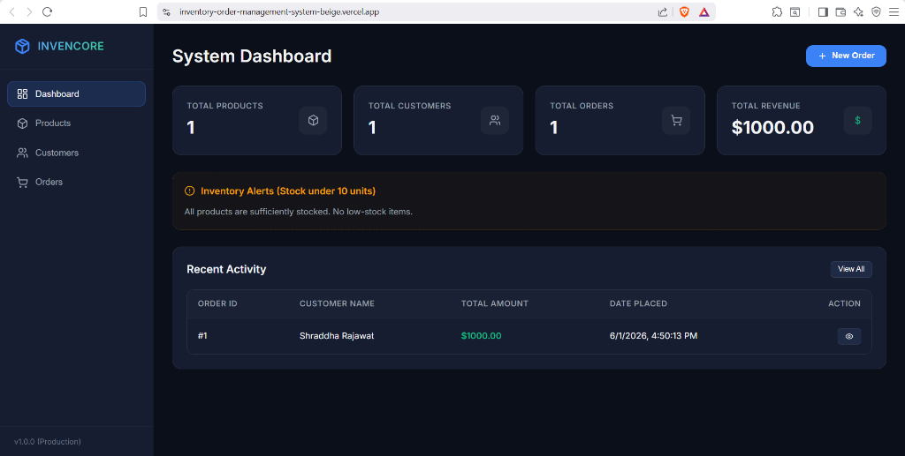
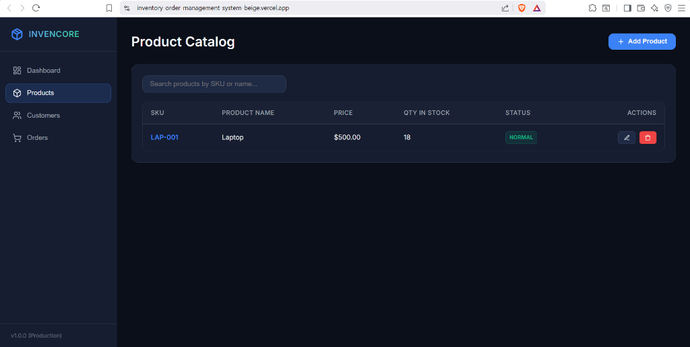
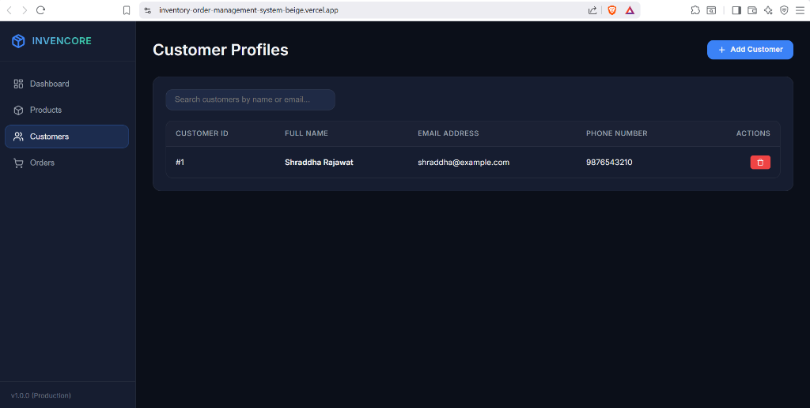
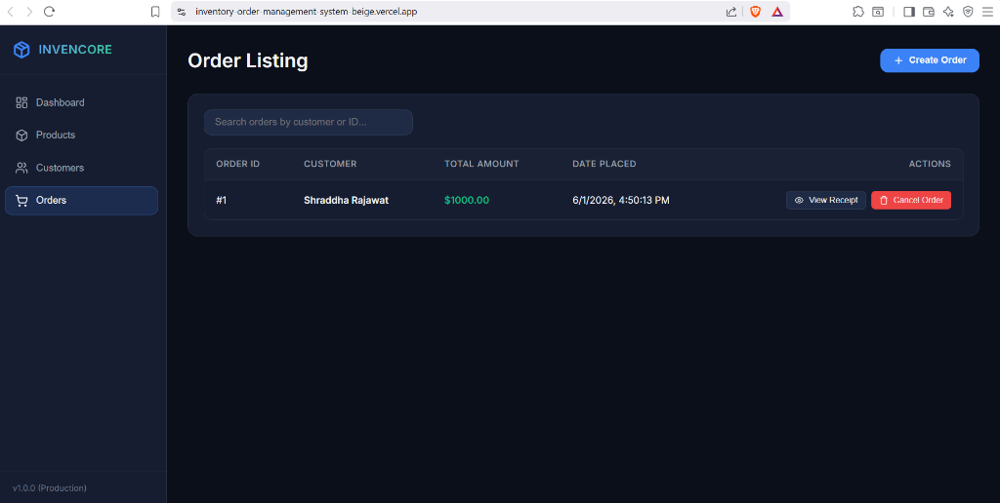

# Inventory & Order Management System

A production-ready, containerized, full-stack **Inventory & Order Management System** built with **FastAPI (Python)**, **React.js + Vite (JavaScript)**, and **PostgreSQL**. 

The system features transactional business logic (automatic stock deduction on order, stock restoration on order cancellation, and strict inventory level checks) wrapped inside a premium, glassmorphic dark-slate UI design system.

---

## 🚀 Live Deployed Links

- **Live Frontend Web App (Vercel):** [https://inventory-order-management-system-beige.vercel.app/](https://inventory-order-management-system-beige.vercel.app/)
- **Live Backend API (Render):** [https://inventory-backend-d6jx.onrender.com](https://inventory-backend-d6jx.onrender.com)
- **Interactive API Documentation (Swagger Docs):** [https://inventory-backend-d6jx.onrender.com/docs](https://inventory-backend-d6jx.onrender.com/docs)

---

## 📸 System Screenshots

### 1. Interactive Dashboard
Metrics tracking total products, customers, orders, total revenue, and dynamic low-stock alerts.


### 2. Product Catalog
Inventory catalog management with real-time stock levels and automated status indicators (NORMAL, LOW STOCK, OUT OF STOCK).


### 3. Customer Profiles
Customer database management showing unique profile summaries.


### 4. Order Listing & Tracking
Comprehensive orders list showing checkouts, total cost, timestamp tracking, and direct access to receipt models or order cancellations.


---

## 🛠️ Tech Stack & Architecture

- **Backend:** FastAPI (Python 3.12+), SQLAlchemy ORM, Pydantic validations, PostgreSQL database.
- **Frontend:** React.js, Vite, Vanilla CSS custom design tokens ( Outfit / Inter typography, backdrop blur filters, and fluid layouts).
- **Deployment:** Render (Database & Backend API), Vercel (Frontend Web App), GitHub Actions CI/CD.
- **Containerization:** Docker & Multi-stage Nginx builds compiled via `docker-compose.yml`.

---

## 🚀 How to Run the Project Locally

### Method A: Docker Compose (Recommended)
If you have Docker Desktop running on your machine, simply execute the following command in the root folder:
```bash
docker compose up --build -d
```
- Open `http://localhost` in your browser. Nginx will serve the frontend and automatically proxy all `/api/*` endpoints to the FastAPI container.

### Method B: Manual Launch (Local Dev Servers)

#### 1. Setup Backend
```bash
cd backend
python -m venv venv
# On Windows
.\venv\Scripts\activate
# On macOS/Linux
source venv/bin/activate

pip install -r requirements.txt
uvicorn app.main:app --port 8000 --reload
```
*(By default, the backend will auto-fallback to a local SQLite database file `inventory.db` if no PostgreSQL environment variable is supplied, making local setup zero-config).*

#### 2. Setup Frontend
```bash
cd frontend
npm install
npm run dev
```
- Open `http://localhost:5173/` in your browser. The Vite development proxy will direct API requests to `http://localhost:8000` automatically.

---

## 🛡️ Business Rules Implemented
1. **Relational Consistency:** Full CASCADE deletion constraints across Products, Customers, Orders, and OrderItems.
2. **Unique Identifiers:** Enforcement of unique SKU constraints for products and unique email validation for customers.
3. **Database Transactions:** Placements of orders are processed inside a database transaction session. If a single product is out-of-stock, the entire order is rolled back to prevent inconsistent states.
4. **Stock Calculations:** Ordering items automatically decrements `quantity_in_stock` of the products. Deleting/cancelling an order automatically restores those item quantities back into the stock inventory.
